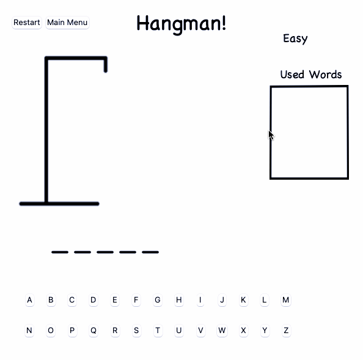

Hangman

This hangman program was created using python and the Tkinter library. 

There is a homepage where the user can select the difficulty of the word, ranging from easy to hard. Random is also an option, with the possibility of any word from easy, medium, or hard to be selected. 

The user is then taken to the game page, where they select a letter from the keyboard on the screen. If a letter is not in the word, it is placed in the used letters table, and another element of the hanging is drawn. If there are multiple of the same letter in the word, all occurrences of the selected letter will be counted towards the word. 

Once the user reaches 7 missed letters, or completes all letters of the word, the game is over and the user has the option to either restart with another word of the same level or go to the main menu and select another difficulty. 

